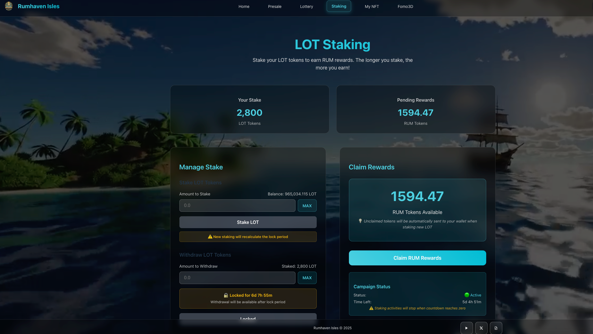

# 2.3 The Merchant's Guild: Stake to Share in the Isles' Prosperity

The Merchant’s Guild provides a steady way for LOT holders to support the ecosystem and earn $RUM rewards. Rules are clear, pacing is stable, and it suits long‑term participation.

**Staking Basics**
- **Process:** Stake $LOT to share $RUM proportional to your stake.
 
- **Principal Lock:** Newly deposited principal has a fixed **7‑day lock** to encourage long‑term participation and pool stability.

**Campaign‑based Rewards**
$RUM is distributed in time‑boxed campaigns with a preset total and duration, released linearly to keep emissions controlled and sustainable.

This approach avoids runaway inflation and enables precise community incentives at key milestones (version updates, community achievements).

> The Founder's Bounty (first campaign)
>
> | Parameter | Value |
> | :--- | :--- |
> | Staking Token | $LOT |
> | Reward Token | $RUM |
> | Principal Lock | 7 days |
> | First Campaign Pool | 100,000 $RUM |
> | First Campaign Duration | 7 days |
>
> During this campaign, a total of 100,000 $RUM is released linearly, second by second, and distributed pro‑rata to all $LOT stakers.

### Sample Campaigns (illustrative)

The following examples help estimate pacing and potential returns. Actual values are announced separately.

| Campaign Name | Total Pool ($RUM) | Duration | Est. APR (example) | Notes |
| :--- | :---: | :---: | :---: | :--- |
| Founder's Bounty | 100,000 | 7 days | ~45% | Higher initial APR to bootstrap participation |
| Season One | 250,000 | 30 days | ~18% | Moderated emission for sustainability |
| Long‑Term Reserve | 1,000,000 | 365 days | ~5% | Long horizon to support steady engagement |

> Note: APR is illustrative and depends on total $LOT staked. Example: if 10,000 LOT are staked, a 100 LOT stake in a 100,000 RUM / 7‑day campaign would earn roughly 1,000 RUM.

 

