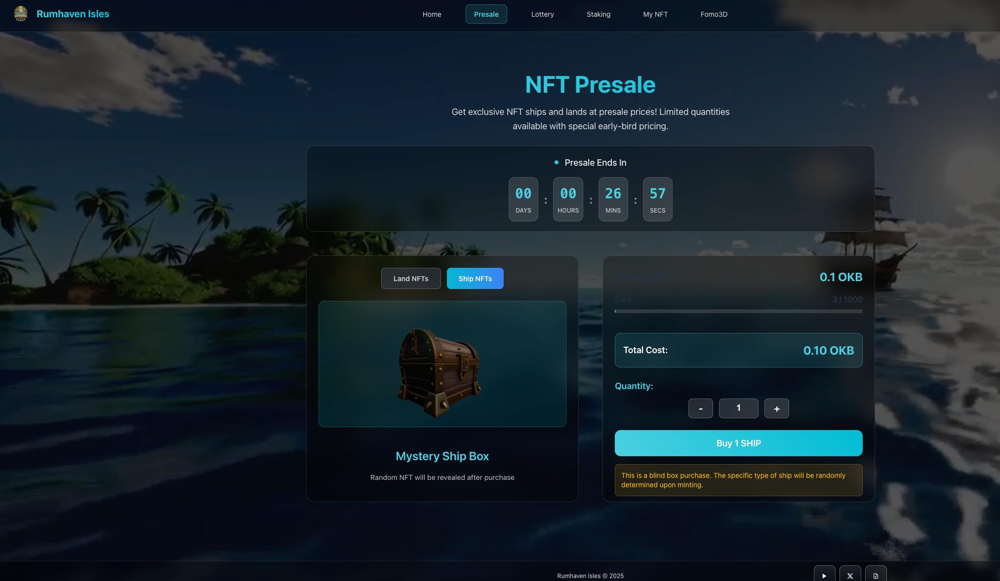

The price shown is for the testnet and for reference only.

# 3.2 The Ships of Fomo Ocean (ShipNFT)

 

Ships are the core tools for exploration and wealth‑building in Fomo Ocean. Each vessel is a unique NFT with clear ownership and free transferability.

All ships belong to one of two factions:
* **Merchant Ships:** Built for reliability and transport efficiency; suited to steady planning and consistent gains.
* **Pirate Ships:** Built for speed and surprise; a higher‑risk path that can yield higher rewards.

This faction split sets up distinct play styles. Future content will deepen each path’s strategic identity.

 
