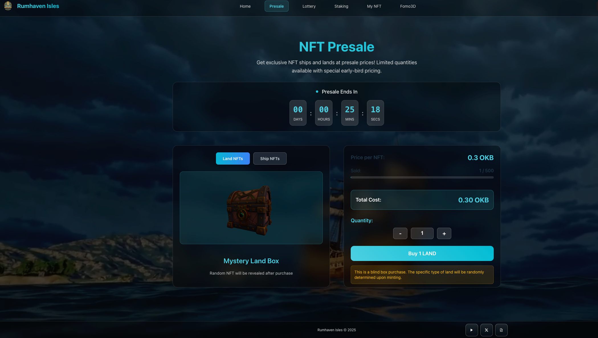

# 3.3 The Lands of the Isles (LandNFT)

The price shown is for the testnet and for reference only.

Unlike ships, land is a long‑term strategic asset. Owning land means establishing a stable base in the Isles. Each plot is a unique NFT with clear ownership and free transferability.

Land does not directly produce $RUM, but it can significantly boost your fleet’s performance. When you hold both a Land and a Ship of matching faction in the same wallet, voyage outcomes improve.

Based on terrain and strategic role, lands fall into two types:
* **Blackrock Heights:** Rugged coasts and hidden coves—ideal for pirates’ operations. High‑risk missions benefit most.
* **Wavecrest Plains:** Stable waters and deep harbors—ideal for merchants to build a prosperous trade hub and maximize steady routes.

 
